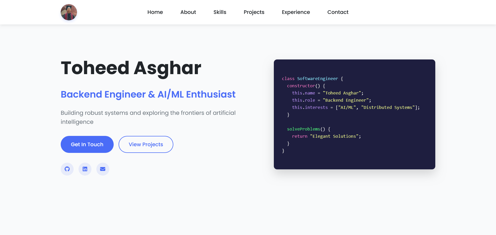

# Toheed Asghar – Professional Portfolio Website

[](https://toheedasghar.netlify.app/)

## About Me

Hi, I'm **Toheed Asghar**.I am a highly motivated Software Engineer with a passion for learning. My interests are in Back-end engineering and Artificial Intelligence/Machine Learning. I graduated from Punjab University College of Information Technology (PUCIT) with a Bachelor of Science in Computer Science.

I am a Quick Learner with exceptional communication, problem solving, and leadership skills.

- **Role:** Backend Engineer & AI/ML Enthusiast
- **Location:** Lahore, Pakistan
- **Email:** toheedasghar@hotmail.com
- **Website:** [toheedasghar.netlify.app](https://toheedasghar.netlify.app/)

## Portfolio Preview

*A preview of my portfolio website's homepage*

## Overview
This is a modern, responsive portfolio website that showcases my professional skills, experience, and projects. It provides a way for potential employers or clients to get in touch and explore my work in backend engineering and AI/ML.

## Features
- Modern and clean design
- Fully responsive layout for all devices
- Interactive UI elements with smooth animations
- Code snippet display with syntax highlighting
- Skills and technologies showcase
- Project portfolio section
- Work experience timeline
- Contact form
- Social media integration

## Technologies Used
### Core Technologies
- **HTML5** - For structure and content
- **CSS3** - For styling, including:
  - Flexbox and Grid layouts
  - Custom CSS variables
  - Responsive design
  - Animations and transitions
- **Vanilla JavaScript** - For interactivity, including:
  - Smooth scrolling
  - Form handling
  - Scroll animations
  - DOM manipulation

### External Resources
- **Font Awesome (v6.4.0)** - For icons
- **Google Fonts**
  - Poppins (general text)
  - Roboto Mono (code blocks)

### Hosting & Deployment
- **Netlify** - For hosting and continuous deployment

## Project Structure
```
├── index.html          # Main HTML file
├── css/
│   └── styles.css      # CSS styles
├── js/
│   └── app.js          # JavaScript functionality
└── README.md           # Project documentation
```

## Sections
1. **Hero Section** – Introduction with a creative code snippet
2. **About** – Personal information and statistics
3. **Skills** – Technical skills categorized by domain
4. **Projects** – Showcase of notable projects
5. **Experience** – Professional work history in a timeline format
6. **Contact** – Contact information and form

## Getting Started
To run this portfolio locally:

1. Clone the repository:
   ```bash
   git clone https://github.com/yourusername/portfolio.git
   cd portfolio
   ```
2. Open `index.html` in your browser or use a local server for development.
3. Customize content in `index.html`, `css/styles.css`, and `js/app.js` as needed.

## Customization
- Replace placeholder text and images with your own information.
- Update the code snippet in the hero section.
- Add your actual projects and work experience.
- Modify colors and styles in `styles.css`.

## Contributing
Contributions are welcome! Please open an issue or submit a pull request for improvements or bug fixes.

## License
This project is open source and available under the [MIT License](LICENSE).

## Contact
- **Email:** toheedasghar@hotmail.com
- **Portfolio:** [toheedasghar.netlify.app](https://toheedasghar.netlify.app/)
- **Location:** Lahore, Pakistan

---

### About Section for GitHub (Repository Sidebar)
A modern, responsive portfolio website showcasing my work as a Backend Engineer and AI/ML enthusiast. Explore my projects, skills, and professional journey. Let's connect!

- **Website:** https://toheedasghar.netlify.app/
- **Topics:** portfolio, backend, AI, ML, javascript, web-development